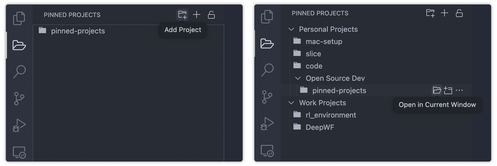
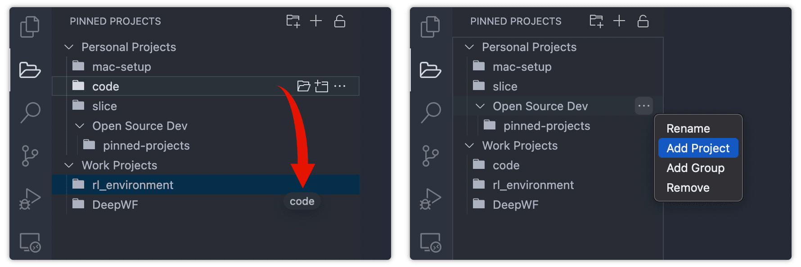
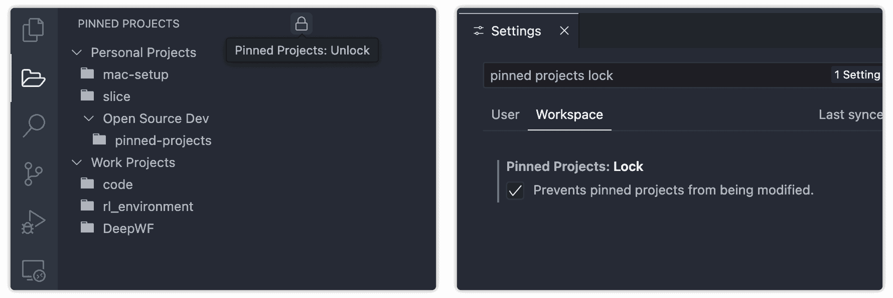

# [Pinned Projects](https://marketplace.visualstudio.com/items?itemName=simplerick.pinned-projects)

The Pinned Projects extension adds the ability to pin favorite projects to the sidebar tab for quick access.

 

## Features

### Favorite Projects Tree

Add your favorite projects and then open any pinned folder with a single click, either in the current window or a new one. You can organize your projects as a tree with arbitrary depth using "groups".

### Easy Configuration 

There's no need to open settings to configure your projects — all modifications can be done natively in the tree view.

- Rearrange and nest items using drag-and-drop actions.
- Rename, delete groups and projects, and add new ones.

 

To prevent accidental changes, you can lock the tree state with a toggle. This state is synchronized with the only settings option: `pinnedProjects.lock`.

 

## License

[MIT](LICENSE.md)